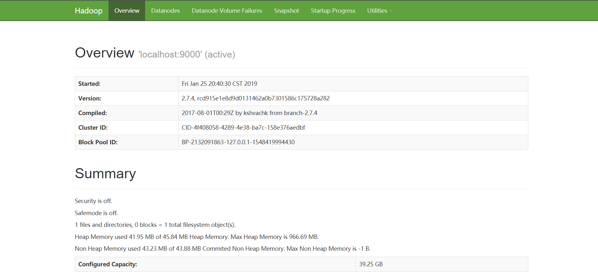
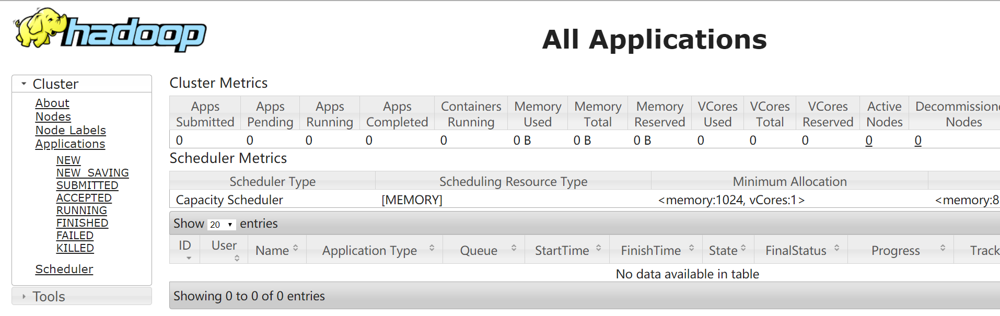

> 微信公众号：**大佛拈花**
> 关注可了解更多的教程及排版技巧。问题或建议，请公众号留言;

### 1 硬件信息

1vCPUs | 1GB | s3.small.1
CentOS 7.2 64bit

### 2 Java环境

1 安装JDK8

1 下载安装

```bash
sudo yum install java-1.8.0-openjdk java-1.8.0-openjdk-devel
```

2 配置环境变量

```bash
vi ~/.bashrc
1export JAVA_HOME=/usr/lib/jvm/java-1.8.0-openjdk
2
3保存文件后执行下面命令使 JAVA_HOME 环境变量生效:
4source ~/.bashrc
```


测试：`java -version`

```bash
1[root@gosaint ~]# java -version
2openjdk version "1.8.0_191"
3OpenJDK Runtime Environment (build 1.8.0_191-b12)
4OpenJDK 64-Bit Server VM (build 25.191-b12, mixed mode)
```


### 3 安装hadoop

1 下载安装

```
1wget https://archive.apache.org/dist/hadoop/common/hadoop-2.7.4/hadoop-2.7.4.tar.gz
```


2 文件重命名

```bash
1cd /usr/local
2mv ./hadoop-2.7.4/ ./hadoop
```


3 检测hadoop是否安装

```bash
/usr/local/hadoop/bin/hadoop version
```

4 环境变量配置

```bash
 1vi ~/.bashrc
 2追加：
 3export HADOOP_HOME=/usr/local/hadoop
 4export HADOOP_INSTALL=$HADOOP_HOME
 5export HADOOP_MAPRED_HOME=$HADOOP_HOME
 6export HADOOP_COMMON_HOME=$HADOOP_HOME
 7export HADOOP_HDFS_HOME=$HADOOP_HOME
 8export YARN_HOME=$HADOOP_HOME
 9export HADOOP_COMMON_LIB_NATIVE_DIR=$HADOOP_HOME/lib/native
10export PATH=$PATH:$HADOOP_HOME/sbin:$HADOOP_HOME/bin
11环境变量生效
12source ~/.bashrc
```


5 修改 Hadoop 的配置文件

Hadoop的配置文件位于安装目录的 /etc/hadoop 目录下，在本教程中即位于 /url/local/hadoop/etc/hadoop 目录下，需要修改的配置文件为如下两个:

```bash
1/usr/local/hadoop/etc/hadoop/core-site.xml
2/usr/local/hadoop/etc/hadoop/hdfs-site.xml
```


编辑 core-site.xml，修改节点的内容为如下所示：
core-site.xml

```xml
 1<configuration>
 2    <property>
 3        <name>hadoop.tmp.dir</name>
 4        <value>file:/usr/local/hadoop/tmp</value>
 5        <description>location to store temporary files</description>
 6    </property>
 7    <property>
 8        <name>fs.defaultFS</name>
 9        <value>hdfs://10.112.38.11:9000</value>
10    </property>
11</configuration>
```


同理，编辑 hdfs-site.xml，修改节点的内容为如下所示：

```xml
 1<configuration>
 2    <property>
 3        <name>dfs.replication</name>
 4        <value>1</value>
 5    </property>
 6    <property>
 7        <name>dfs.namenode.name.dir</name>
 8        <value>file:/usr/local/hadoop/tmp/dfs/name</value>
 9    </property>
10    <property>
11        <name>dfs.datanode.data.dir</name>
12        <value>file:/usr/local/hadoop/tmp/dfs/data</value>
13    </property>
14</configuration>
```


6 格式化 NameNode

```bash
/usr/local/hadoop/bin/hdfs namenode -format
```

在输出信息中看到如下信息，则表示格式化成功:

```bash
1Storage directory /usr/local/hadoop/tmp/dfs/name has been successfully formatted.
2Exiting with status 0
```


7 启动 NameNode 和 DataNode 守护进程

```bash
/usr/local/hadoop/sbin/start-dfs.sh
```

8 检查NameNode和DataNode是否正常启动

```bash
1jps
2[root@gosaint ~]$ jps
33689 SecondaryNameNode
43520 DataNode
53800 Jps
63393 NameNode
```


访问：http://ip:50070/



9 关闭主程序

最后，如果使用完毕，可以关闭Hadoop。
`[root@centos7 hadoop-2.7.3]# sbin/stop-dfs.sh`

10 YARN来提交job

配置1 mapred-site.xml

```
1修改模板文件名：
2mv /usr/local/hadoop/etc/hadoopmapred-site.xml.template /usr/local/hadoop/etc/hadoop/mapred-site.xml
```


```
1vi /usr/local/hadoop/etc/hadoop/mapred-site.xml
2
3<configuration>
4    <property>
5        <name>mapreduce.framework.name</name>
6        <value>yarn</value>
7    </property>
8</configuration>
```


配置2 配置yarn-site.xml

```xml
1<configuration>
2<!-- Site specific YARN configuration properties -->
3    <property>
4        <name>yarn.nodemanager.aux-services</name>
5        <value>mapreduce_shuffle</value>
6    </property>
7</configuration>
```


11：启动ResourceManager和NodeManager

注意：执行下面的命令之前，先确保已执行"sbin/start-dfs.sh"。
`[root@centos7 hadoop-2.7.3]# sbin/start-yarn.sh`

12：启动historyserver

[root@centos7 hadoop-2.7.3]# sbin/mr-jobhistory-daemon.sh start

确认进程已启动

```xml
1[root@gosaint ~]# jps
21670 ResourceManager
31272 NameNode
41769 NodeManager
51370 DataNode
62234 Jps
71501 SecondaryNameNode
81838 JobHistoryServer
```


访问：http://ip:8088/



至此，hadoop的伪分布式环境搭建完毕！

