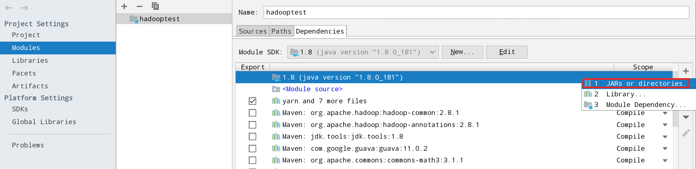
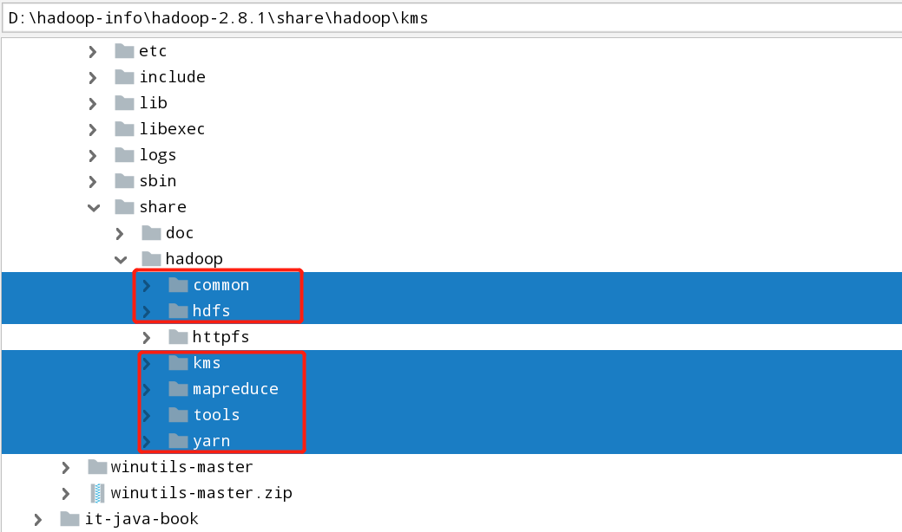
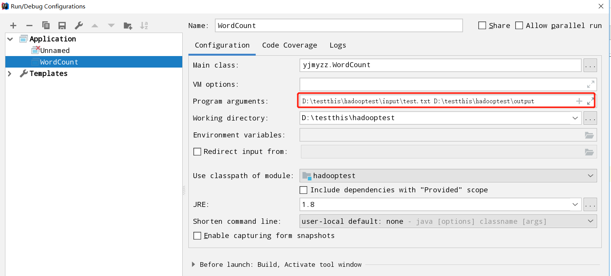
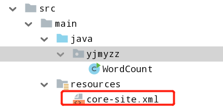
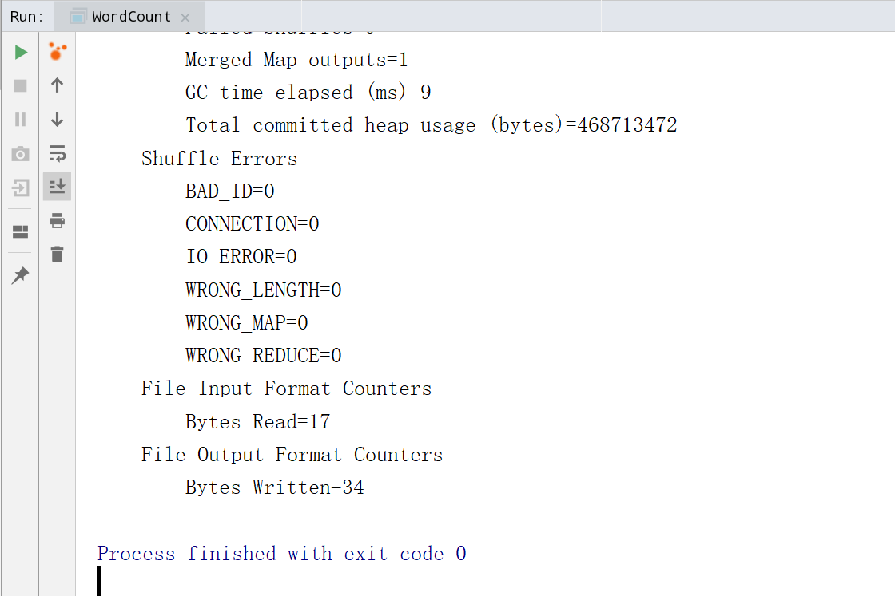

>>微信公众号：**[大佛拈花](#jump_10)**
>>对于Hadoop的本地开发环境的搭建，我本人是在Linux服务器上搭建的，但是发现遇到了诸多的问题，首先是本地调试和服务器上存在差异，需要上传Jar包等。最为重要的是还是对环境不太熟悉。因此我本人选择搭建了Hadoop的windows环境，这个过程还算比较顺利。但是在码代码的过程中还是遇到了一些的问题。关于Hadoop的windows环境搭建，网上的教程算是比较多的，大家也可以参照实施。


# 1 新建项目maven  hadoop-test

## 1.1 maven依赖

```xml
    <dependencies>
        <dependency>
            <groupId>org.apache.hadoop</groupId>
            <artifactId>hadoop-common</artifactId>
            <version>2.8.1</version>
        </dependency>
        <dependency>
            <groupId>org.apache.hadoop</groupId>
            <artifactId>hadoop-mapreduce-client-jobclient</artifactId>
            <version>2.8.1</version>
        </dependency>
        <dependency>
            <groupId>commons-cli</groupId>
            <artifactId>commons-cli</artifactId>
            <version>1.2</version>
        </dependency>
    </dependencies>
```


## 1.2 添加Hadoop本地开发包环境

打开Moudle setting。然后添加依赖的hadoop包




选择Hadoop安装目录下的share目录下的文件：




## 1.3 测试代码

下面的代码不用每一次取删除output目录。

```java
/**
 * @author gosaint
 */
public class WordCount {

    public static class TokenizerMapper
            extends Mapper<Object, Text, Text, IntWritable> {

        private final static IntWritable one = new IntWritable(1);
        private Text word = new Text();

        @Override
        public void map(Object key, Text value, Context context) throws IOException, InterruptedException {
            StringTokenizer itr = new StringTokenizer(value.toString());
            while (itr.hasMoreTokens()) {
                word.set(itr.nextToken());
                context.write(word, one);
            }
        }
    }

    public static class IntSumReducer extends Reducer<Text, IntWritable, Text, IntWritable> {
        private IntWritable result = new IntWritable();
        @Override
        public void reduce(Text key, Iterable<IntWritable> values, Context context) throws IOException, InterruptedException {
            int sum = 0;
            for (IntWritable val : values) {
                sum += val.get();
            }
            result.set(sum);
            context.write(key, result);
        }
    }


    /**
     * 删除指定目录
     *
     * @param conf
     * @param dirPath
     * @throws IOException
     */
    private static void deleteDir(Configuration conf, String dirPath) throws IOException {
        FileSystem fs = FileSystem.get(conf);
        Path targetPath = new Path(dirPath);
        if (fs.exists(targetPath)) {
            boolean delResult = fs.delete(targetPath, true);
            if (delResult) {
                System.out.println(targetPath + " has been deleted sucessfullly.");
            } else {
                System.out.println(targetPath + " deletion failed.");
            }
        }

    }

    public static void main(String[] args) throws Exception {
        Configuration conf = new Configuration();
        String[] otherArgs = new GenericOptionsParser(conf, args).getRemainingArgs();
        if (otherArgs.length < 2) {
            System.err.println("Usage: wordcount <in> [<in>...] <out>");
            System.exit(2);
        }

        //先删除output目录
        deleteDir(conf, otherArgs[otherArgs.length - 1]);

        Job job = Job.getInstance(conf, "word count");
        job.setJarByClass(WordCount.class);
        job.setMapperClass(TokenizerMapper.class);
        job.setCombinerClass(IntSumReducer.class);
        job.setReducerClass(IntSumReducer.class);
        job.setOutputKeyClass(Text.class);
        job.setOutputValueClass(IntWritable.class);
        for (int i = 0; i < otherArgs.length - 1; ++i) {
            FileInputFormat.addInputPath(job, new Path(otherArgs[i]));
        }
        FileOutputFormat.setOutputPath(job,
                new Path(otherArgs[otherArgs.length - 1]));
        System.out.println("测试开始===========>");
        System.exit(job.waitForCompletion(true) ? 0 : 1);
    }
}
```

## 1.4 配置运行参数



## 1.5 添加core-site.xml



```xml
<?xml version="1.0" encoding="UTF-8"?>
<?xml-stylesheet type="text/xsl" href="configuration.xsl"?>


<configuration>
  
</configuration>

```

# 2 运行程序Main方法



最终运行成功。


# 3 关于异常

## 3.1 java.lang.NoSuchMethodError: org.apache.hadoop.security.authentication.util.KerberosUtil.hasKerberosTicket(Ljavax/security/auth/Subject;)Z

出现该异常的原因是Hadoop版本和依赖的版本不一致

```xml
        <dependency>
            <groupId>org.apache.hadoop</groupId>
            <artifactId>hadoop-common</artifactId>
            <version>2.8.1</version>
        </dependency>
        <dependency>
            <groupId>org.apache.hadoop</groupId>
            <artifactId>hadoop-mapreduce-client-jobclient</artifactId>
            <version>2.8.1</version>
        </dependency>
```

这是我之前的配置，但是我的Hadoop是2.8.1.最后我修改完毕，错误解决！

## 3.2 D:/testthis/hadooptest/output is not a valid DFS filename.

分不清HDFS环境和本地环境

```xml
<configuration>
   <property>
        <name>fs.defaultFS</name>
        <value>hdfs://localhost:9000/</value>
    </property>

    <property>
        <name>hadoop.tmp.dir</name>
        <value>file:///D:/hadoop-info/hadoop-2.8.1/data/tmp</value>
    </property>
</configuration>
```

这是我之前的core-site.xml.这里的配置和Main的启动参数配置不一致。导致系统分不清是HDFS环境还是本地环境。