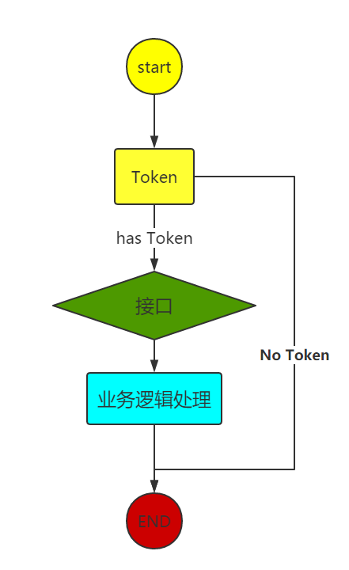

# 1 幂等性概念

​	在Java领域，我们有时候或者大多时侯都要保证接口幂等。那么什么是幂等呢？简单的来说就是防止重复提交数据或者重复对接口的调用。这在金融领域或者电商领域显得尤为重要。比如一笔订单我们要保证不能重复提交。当前前端也可以做部分的限制，但是我们应该在后端做相应的处理，以保证我们的数据操作符合业务逻辑。

## 1.1表单重复提价问题

  	rpc远程调用时候 发生网络延迟  可能有重试机制

  	MQ消费者幂等（保证唯一）一样 

# 2 基于Redis+Token幂等

​	这也就是我为什么这里为什么是接口的幂等设计一的原因啦。实现的方式当然是多种的。比如乐观锁机制等。这里我们使用了唯一Token的方式来实现。流程如下：



​	说明下流程：

​	1 假设前端准备提交支付按钮

​	2 此时准备提交表单数据，并且表单存在Token.

​	3 后台校验Token,并且此时删除Redis的Token

​	4 处理逻辑

​	5 当点击重复提交的时候，此时的Token还是之前的Token

​	6 后端发现Redis中无该Token,表示重复提交，直接返回！

# 3 代码实现


## 3.1 注解封装

ExtAPIIdempotent  form表单提交封装

```java
@Target(value = ElementType.METHOD)
@Retention(RetentionPolicy.RUNTIME)
public @interface ExtAPIIdempotent {
    String value();
}
```

ExtAPIToken  Token封装

```java
@Target(value = ElementType.METHOD)
@Retention(RetentionPolicy.RUNTIME)
public @interface ExtAPIToken {

}
```

## 3.2 AOP

AOP作用就是拦截到所有的标明上述注解的方法，在跳转到表单的时候设置Token以及表单提交的时候校验Token。

```java
@Component
@Aspect
public class ExtApiAopIdemComponent {

    @Autowired
    private RedisTokenComponent redisToken;
    /**
     * 作用的类：切点
     */
    @Pointcut("execution(public * com.gosaint.idempotency.controller.*.*(..))")
    public void rlAop(){
    }

    /**
     * 前置通知转发Token参数  进行拦截的逻辑
     * @param joinPoint
     */
    @Before("rlAop()")
    public void before(JoinPoint joinPoint){
        MethodSignature signature = (MethodSignature )joinPoint.getSignature();
        //查询所有的方法上面有Token注解的
        ExtAPIToken apiToken = signature.getMethod().getDeclaredAnnotation(ExtAPIToken.class);
        if(apiToken!=null){
            /**
             * 如果存在Token注解
             * （1）从redis中获取Token,然后存储到request请求头里面
             */
            apiToken();
        }
    }

    /**
     * 环绕通知参数验证
     * @param proceedingJoinPoint
     * @return
     * @throws Throwable
     */
    @Around("rlAop()")
    public Object doAround(ProceedingJoinPoint proceedingJoinPoint) throws Throwable {
        MethodSignature signature = (MethodSignature )proceedingJoinPoint.getSignature();
        //查询所有的方法上面有Token注解的
        ExtAPIIdempotent extAPIIdempotent =
                signature.getMethod().getDeclaredAnnotation(ExtAPIIdempotent.class);
        if(extAPIIdempotent!=null){
            //有注解的情况 有注解的说明需要进行token校验
            return extAPIIdempotent(proceedingJoinPoint, extAPIIdempotent);
        }
        //如果没有注解。直接放行执行逻辑
        Object proceed = proceedingJoinPoint.proceed();
        return proceed;
    }

    private Object extAPIIdempotent(ProceedingJoinPoint proceedingJoinPoint, ExtAPIIdempotent apiIdempotent) throws Throwable {
        HttpServletRequest request = getRequest();
        String valueType = apiIdempotent.value();
        if (StringUtils.isEmpty(valueType)) {
            response("参数错误!");
            return null;
        }
        String token=null;
        //如果存在header中 从头中获取
        if(valueType.equals(ConstantUtils.EXTAPIHEAD)){
             token = request.getHeader("token");
        }else {
            //否则从请求参数中获取
            token=request.getParameter("token");
        }
        if (StringUtils.isEmpty(token)) {
            response("参数错误!");
            return null;
        }
        boolean isToken = redisToken.checkToken(token);
        if(!isToken){
            response("请勿重复提交!");
            return null;
        }
        Object proceed = proceedingJoinPoint.proceed();
        return proceed;
    }

    private void response(final String msg) throws IOException {
        ServletRequestAttributes attributes = (ServletRequestAttributes) RequestContextHolder.getRequestAttributes();
        HttpServletResponse response = attributes.getResponse();
        response.setHeader("Content-type", "text/html;charset=UTF-8");
        PrintWriter writer = response.getWriter();
        try {
            writer.println(msg);
        } catch (Exception e) {
        } finally {
            writer.close();
        }
    }

    private void apiToken() {
        getRequest().setAttribute("token",redisToken.getToken());
    }

    public HttpServletRequest getRequest(){
        ServletRequestAttributes requestAttributes = 
                (ServletRequestAttributes )RequestContextHolder.getRequestAttributes();
        HttpServletRequest request = requestAttributes.getRequest();
        return request;
    }
}
```

## 3.3 Controller

```java
Controller
public class IdempotencyController {

    private static final Logger logger =  LoggerFactory.getLogger(IdempotencyController.class);

    /**
     * 页面测试
     * @param model
     * @return
     * 统一设置Token
     */
    @RequestMapping("/idemo")
    @ExtAPIToken
    public ModelAndView ideoFormvertify(Model model){
        ModelAndView modelAndView=new ModelAndView();
        modelAndView.setViewName("order");
        return modelAndView;
    }

    @RequestMapping(value = "/idemo/trans")
    @ResponseBody
    @ExtAPIIdempotent(value = "form")
    public String addUserPage(HttpServletRequest request) {
        return "添加成功！";
    }

}
```

## 3.4 表单

```html
<!DOCTYPE html>
<html lang="en">
<head>
    <meta charset="UTF-8">
    <title>Token幂等</title>
</head>
<body>
<form action="/idemo/trans" method="post">
    <input type="hidden" id="token" name="token" value="${token}">
    name: <input id="name" name="name" />
    <p>age:  <input id="age" name="age" />
    <p><input type="submit" value="submit" />
</form>
</body>
<script type="text/javascript">
    var value = document.getElementById("token").value;
    alert(value);
</script>
</html>
```

[Github地址](https://github.com/gosaintmrc/idempotency)

